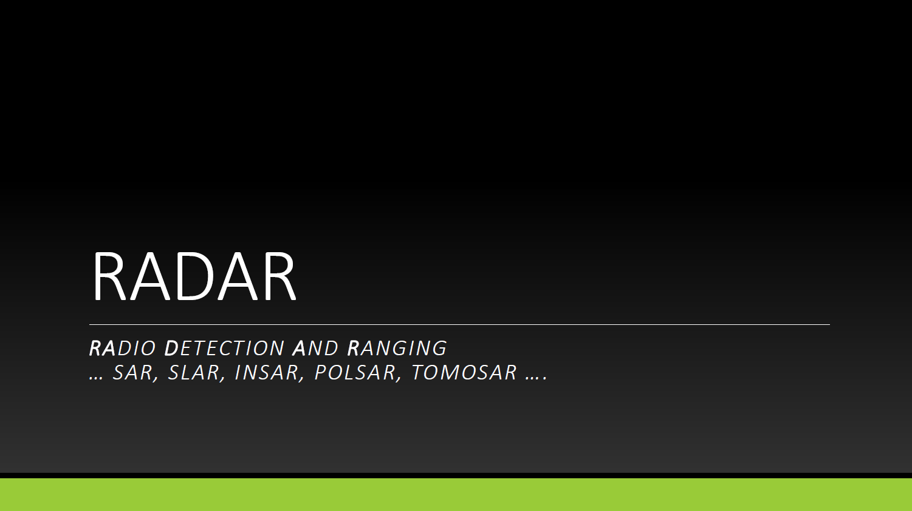

## Introduction to Radar Remote Sensing of Forests

Forests present unique challenges for remote sensing. Persistent cloud cover in tropical regions can block optical satellites for weeks or months, while even in temperate zones, dense canopies obscure the forest floor and understory. Radar (Radio Detection and Ranging) remote sensing fundamentally transforms forest monitoring by operating independently of clouds, darkness, and solar illumination—transmitting its own microwave energy and measuring the backscattered return signal.

**Active Sensing in the Microwave Window**

Unlike passive optical sensors that depend on reflected sunlight, radar systems actively illuminate the Earth's surface with microwave radiation. This active approach, combined with microwave wavelengths ranging from millimeters to meters, exploits a unique atmospheric window where clouds, fog, and precipitation cause minimal signal attenuation. The electromagnetic spectrum shows a critical gap between solar radiation and Earth's thermal emission precisely in the microwave region—where natural radiation is minimal but atmospheric transmission is excellent. This combination necessitates active illumination while enabling all-weather, day-and-night observation capabilities that overcome the primary limitations of optical remote sensing in forested regions.

**Penetrating Vegetation with Long Wavelengths**

The wavelength-dependent penetration of radar waves provides information fundamentally different from optical sensors. While optical systems see only the canopy surface, microwave radiation penetrates into and through vegetation depending on wavelength: X-band (3 cm) interacts primarily with leaves and small branches, C-band (6 cm) used by Sentinel-1 penetrates somewhat deeper, while L-band (24 cm) and P-band (70 cm) reach large branches, trunks, and even the ground beneath dense canopy. This penetration capability enables radar to sense forest structure, stem volume, and subsurface moisture—parameters that remain largely invisible to optical methods but are critical for understanding forest biomass, health, and ecosystem function.

**From Backscatter Patterns to Forest Parameters**

The key to extracting forest information from radar lies in understanding how electromagnetic waves interact with vegetation structure. Different polarizations reveal different scattering mechanisms: HH (horizontal transmit and receive) highlights ground and trunk interactions, VV (vertical) shows intermediate behavior, while VH and HV cross-polarizations emphasize volume scattering from branches and leaves distributed throughout the canopy. By analyzing backscatter intensity across polarizations, wavelengths, and time, researchers can estimate forest height, biomass, moisture content, and structural changes. Semi-empirical models like the Water Cloud Model partition the total backscatter into vegetation and soil components, enabling quantitative retrieval of biophysical parameters from operational satellite missions like Sentinel-1. With systematic global coverage from current missions and upcoming systems like NISAR and BIOMASS, radar has become an indispensable tool for operational forest monitoring and carbon accounting.

## Where to go further?

Watch the **video lecture** introducing radar remote sensing concepts:



View and download the **presentation** from the video:

[{.border width="200px"}](https://drive.google.com/file/d/1V88K6caQK7J6FraQZqkqEGk5wquS20lL/view?usp=sharing)

Read the [**theory**](RADAR_theory.qmd)

Analyze real data with a [**practical tutorial in Python**](RADAR_tutorial.qmd)

------------------------------------------------------------------------

